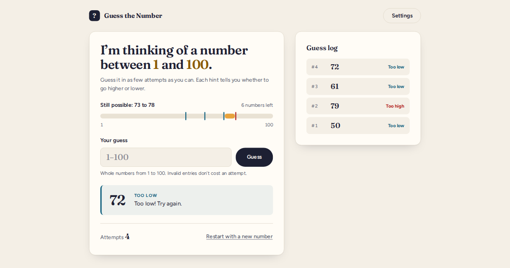
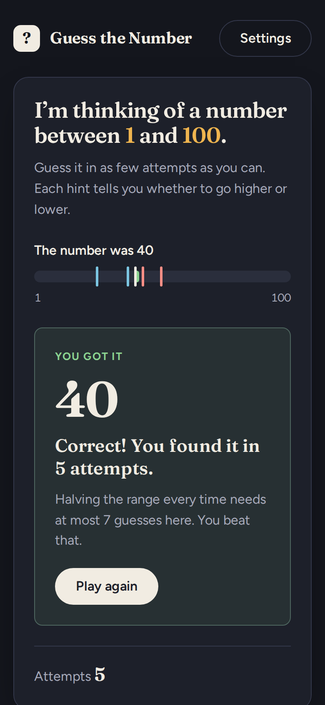

# Guess the Number

A small logic game: the computer picks a secret number and you find it in as few guesses as you can, guided by "too high" and "too low" hints. It runs in the browser and in any terminal, and both versions share the same game engine.

**Live demo:** [number-guessing-game-fz17.vercel.app](https://number-guessing-game-fz17.vercel.app/)





## Features

- Secret number drawn from a configurable range (1–10 up to 1–1000, default 1–100) using the browser's or Node's cryptographic random number generator.
- Input validation: letters, symbols, decimals, out-of-range numbers, and repeat guesses are rejected with a clear message and never cost an attempt.
- "Too high! Try again." / "Too low! Try again." hints, a live attempt counter, and a guess log.
- A range tracker that shows which numbers are still possible after each hint.
- Optional attempt limit (5, 7, 10, or 15). Running out ends the game and reveals the number.
- Play again from the win or loss screen, with a fresh secret number.
- Keyboard-friendly and screen-reader-friendly: labelled fields, visible focus, announced hints, and reduced-motion support. Light and dark themes follow your system setting.
- Terminal version for Windows, macOS, and Linux.
- No accounts, cookies, analytics, or network requests after the page loads.

## Getting started

Requires [Node.js](https://nodejs.org/) 20 or newer.

```bash
git clone https://github.com/fazal305/Number-Guessing-Game.git
cd Number-Guessing-Game
npm install
npm run dev
```

Open the URL Vite prints (usually http://localhost:5173).

### Play in the terminal

```bash
npm run cli                          # 1–100, unlimited attempts
npm run cli -- --max 1000 --limit 10 # 1–1000, 10 attempts
npm run cli -- --help
```

Type `q` at any prompt to quit.

### Scripts

| Command           | What it does                              |
| ----------------- | ----------------------------------------- |
| `npm run dev`     | Start the dev server                      |
| `npm run build`   | Production build into `dist/`             |
| `npm run preview` | Serve the production build locally        |
| `npm test`        | Run the engine tests (Vitest)             |
| `npm run lint`    | Lint with ESLint                          |
| `npm run cli`     | Play in the terminal                      |

### Environment variables

None. The game has no backend and needs no keys or configuration.

## How it works

```
src/
  game/
    engine.js        Pure game rules: create game, parse/validate guesses, compare, win/loss
    random.js        Unbiased random integer from crypto.getRandomValues
    useGame.js       React hook wrapping the engine in a reducer
    engine.test.js   Unit tests for the rules
  components/        Range meter, guess form, feedback, counter, result, log, settings dialog
  App.jsx            Layout and focus management
  styles.css         Design tokens and styles
cli/index.js         Terminal version, built on the same engine
public/              Favicon, 404 page, social preview image, robots.txt
```

Every guess is checked synchronously by plain functions with no I/O, so feedback appears immediately. A test asserts each guess is processed well under the 50 ms target.

**Randomness.** The secret comes from `crypto.getRandomValues`, which the operating system seeds with runtime entropy, so every game gets a fresh number with no manual seeding. Rejection sampling keeps every number in the range equally likely.

## Design

- **Look:** warm paper background, deep ink text, and a single marigold accent for the "still possible" range. Red and blue mark too high and too low, and every hint also carries a text label so color is never the only signal.
- **Type:** Fraunces (display and numbers) with Figtree (interface text). Both are self-hosted through Fontsource, so no requests go to third-party font servers.
- **Layout:** one column on phones. On wider screens the game card sits beside the guess log.
- All text meets WCAG AA contrast in both light and dark themes.

## Deployment

The project is set up for [Vercel](https://vercel.com/). `vercel.json` sets the build output and security headers (Content Security Policy, `nosniff`, Referrer-Policy, frame-ancestors), and Vercel serves `public/404.html` for unknown paths.

1. Import the repository in Vercel. The settings are detected from `vercel.json`.
2. Make sure Deployment Protection is off for the production URL so the game is public.
3. If you deploy under a different URL, update it in `index.html` (canonical, `og:url`, image URLs), `public/robots.txt`, `public/sitemap.xml`, and the link at the top of this README.

Any static host works. Serve the `dist/` folder after `npm run build`.

## Contributing

See [CONTRIBUTING.md](CONTRIBUTING.md). Please follow the [Code of Conduct](CODE_OF_CONDUCT.md), and report security issues as described in [SECURITY.md](SECURITY.md).

## License

[MIT](LICENSE)
